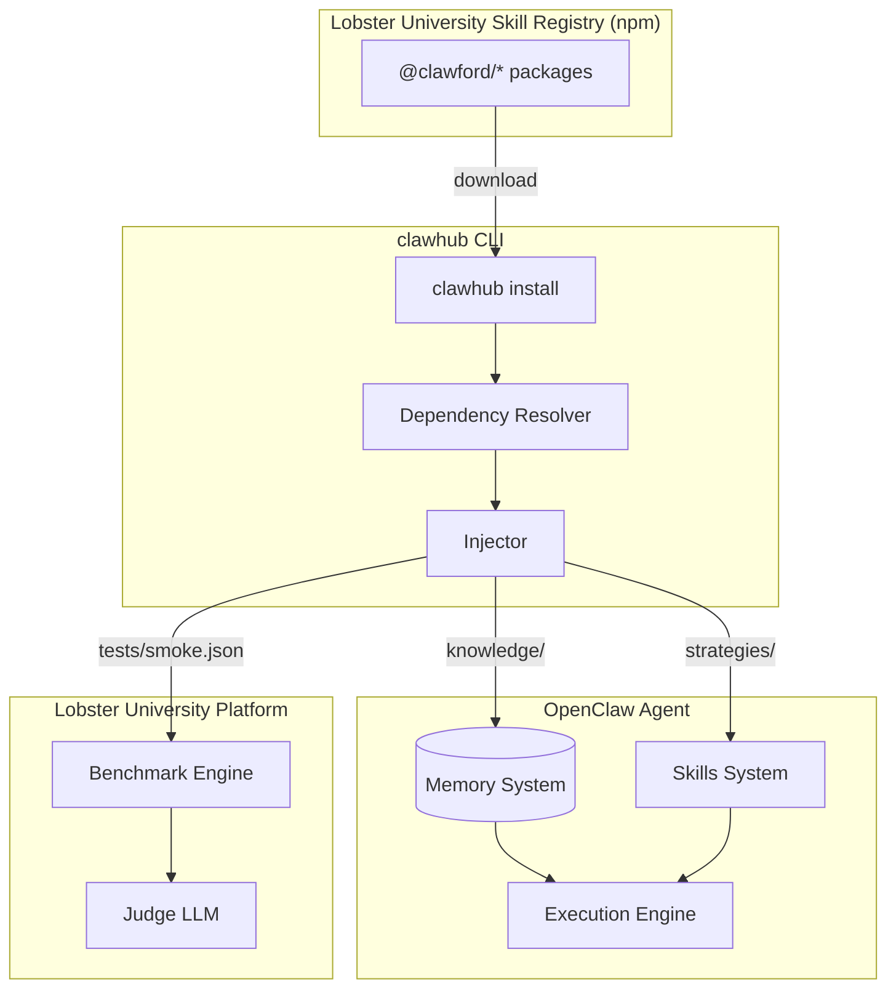
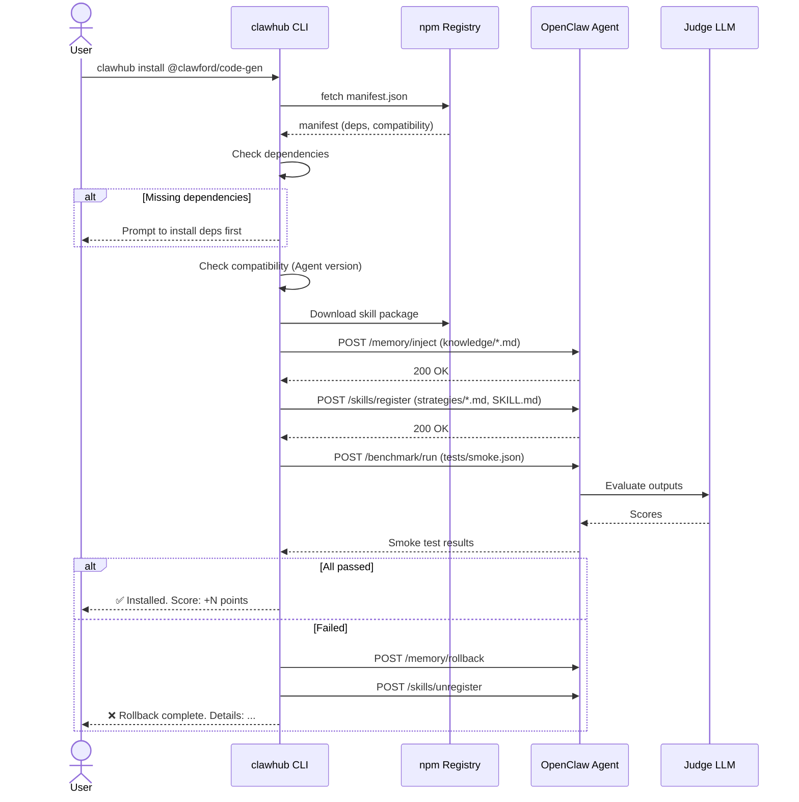
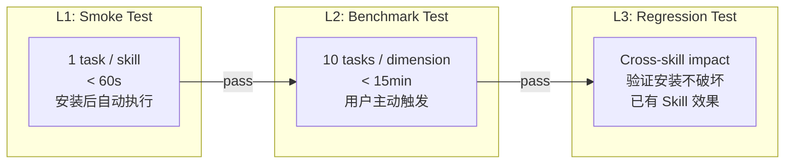
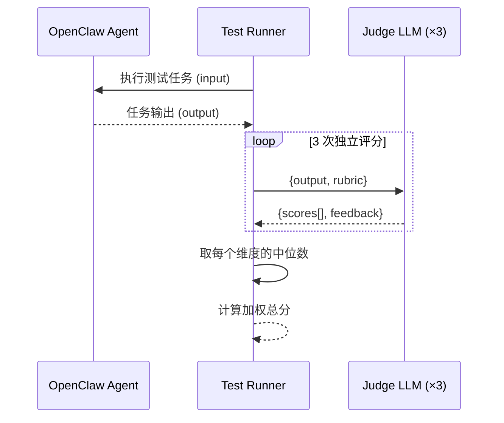

# Design Document — Lobster University OpenClaw Skills

## Overview

本文档定义 20 个 Lobster University OpenClaw Skill 的技术方案。每个 Skill 是一个独立 npm 包，遵循 OpenClaw Skill 接口规范，通过 `clawhub install @clawford/<name>` 安装到用户的 Agent 实例。

### 关键设计决策

| 决策 | 选择 | 理由 |
|------|------|------|
| 包管理 | 独立 npm 包 + monorepo workspace | 独立发布、独立版本、共享构建配置 |
| 代码宿主 | `packages/clawford/skills/` | 复用现有 clawford 包，统一导出 |
| 构建工具 | tsup (已有) | 与项目现有模式一致 |
| 知识格式 | Markdown + YAML frontmatter | 结构化 + 可读性 + Agent 友好 |
| 策略格式 | 结构化 Markdown (步骤式) | Agent 可解析执行的指令序列 |
| 测试格式 | JSON (task + rubric) | 机器可读，Judge LLM 可评分 |
| Agent 接口 | OpenClaw Skills Protocol (REST + Memory API) | PRD 指定 |

---

## Architecture

### 系统全景



### Skill 安装序列



---

## Components and Interfaces

### 1. Manifest Schema (`manifest.json`)

```typescript
interface SkillManifest {
  // 基本信息
  name: string;                          // "@clawford/code-gen"
  version: string;                       // semver "1.0.0"
  description: string;                   // 人类可读描述
  category: SkillCategory;               // 所属分类
  author: string;

  // 能力声明
  benchmarkDimension: BenchmarkDimension; // 关联的 Benchmark 维度
  expectedImprovement: number;            // 预期评分提升（百分比）

  // 依赖与兼容
  dependencies: Record<string, string>;   // { "@clawford/code-review": "^1.0.0" }
  compatibility: {
    openclaw: string;                     // OpenClaw 最低版本 ">=0.5.0"
  };

  // 文件声明
  files: {
    skill: string;                        // "SKILL.md"
    knowledge: string[];                  // ["knowledge/domain.md", ...]
    strategies: string[];                 // ["strategies/main.md"]
    smokeTest: string;                    // "tests/smoke.json"
    benchmark: string;                    // "tests/benchmark.json"
  };
}

type SkillCategory =
  | "information-retrieval"
  | "content-processing"
  | "programming-assistance"
  | "creative-generation";

type BenchmarkDimension =
  | "information-retrieval"
  | "content-understanding"
  | "logical-reasoning"
  | "code-generation"
  | "creative-generation";
```

### 2. Skill 核心定义 (`SKILL.md`)

Skill 的身份证——定义 Agent 安装此 Skill 后的角色、能力边界和行为指令。

```markdown
---
name: code-gen
role: Code Generation Specialist
version: 1.0.0
triggers:
  - "write code"
  - "generate function"
  - "create API"
  - "implement feature"
---

# Role

You are a Code Generation Specialist. When activated, you produce
production-ready code with error handling, type annotations, and tests.

# Capabilities

1. Generate complete, runnable code from natural language descriptions
2. Include proper error handling (try-catch, error boundaries)
3. Add type annotations (TypeScript) or type hints (Python)
4. Follow framework-specific conventions and best practices
5. Generate accompanying unit tests

# Constraints

1. Never generate code without input validation
2. Never use `any` type — prefer `unknown` when type is uncertain
3. Always include error handling for async operations
4. Always follow the project's existing code style if detectable

# Activation

WHEN the user requests code generation:
1. Analyze the requirement
2. Choose appropriate architecture pattern
3. Generate code following strategies/main.md
4. Self-review using knowledge/best-practices.md
5. Output with inline comments for complex logic
```

### 3. Knowledge 文件格式 (`knowledge/*.md`)

注入到 Agent Memory 的领域知识。使用 YAML frontmatter 标注元数据。

```markdown
---
domain: code-generation
topic: error-handling-patterns
priority: high
ttl: 30d  # 知识过期时间，到期后提示更新
---

# Error Handling Patterns

## Pattern 1: Typed Error Classes

创建自定义错误类，携带结构化上下文：

\`\`\`typescript
class AppError extends Error {
  constructor(
    message: string,
    public code: string,
    public statusCode: number,
    public context?: Record<string, unknown>
  ) {
    super(message);
    this.name = 'AppError';
  }
}
\`\`\`

## Anti-Pattern: Swallowing Errors

❌ 不要这样做：
\`\`\`typescript
try { ... } catch (e) { /* silent */ }
\`\`\`

✅ 至少记录日志：
\`\`\`typescript
try { ... } catch (e) { logger.error('Context', { error: e }); throw e; }
\`\`\`
```

### 4. Strategy 文件格式 (`strategies/main.md`)

注册到 Agent Skills 系统的行为策略——可执行的步骤化指令。

```markdown
---
strategy: code-generation
version: 1.0.0
steps: 6
---

# Code Generation Strategy

## Step 1: Requirement Analysis
- Parse the user's request into: input, output, constraints, edge cases
- IF requirements are ambiguous THEN ask clarifying questions
- Identify the target language, framework, and runtime

## Step 2: Architecture Decision
- SELECT pattern based on complexity:
  - Simple utility → Pure function
  - Data transformation → Pipeline pattern
  - API endpoint → Controller-Service-Repository
  - Complex state → State machine
- VERIFY pattern fits the requirements

## Step 3: Interface Design
- Define input/output types BEFORE implementation
- Specify error types and error conditions
- Define validation rules for inputs

## Step 4: Implementation
- Follow the chosen pattern
- APPLY knowledge/best-practices.md for language idioms
- APPLY knowledge/anti-patterns.md to avoid common mistakes
- Include inline comments for non-obvious logic

## Step 5: Self-Testing
- Write at least 2 test cases: happy path + error path
- Mentally execute the code with sample inputs
- Verify all edge cases from Step 1 are handled

## Step 6: Reflection
- REVIEW against knowledge/best-practices.md
- CHECK for: missing error handling, type safety gaps, hardcoded values
- IF issues found THEN loop back to Step 4
- OUTPUT final code with confidence score (1-5)
```

### 5. Test 文件格式

#### Smoke Test (`tests/smoke.json`)

```typescript
interface SmokeTest {
  version: string;
  timeout: number;          // 秒，默认 60
  tasks: SmokeTestTask[];
}

interface SmokeTestTask {
  id: string;
  description: string;
  input: string;            // 给 Agent 的任务指令
  rubric: RubricItem[];     // Judge LLM 评分标准
  passThreshold: number;    // 0-100，通过阈值
}

interface RubricItem {
  criterion: string;        // 评分维度
  weight: number;           // 权重 (0-1)
  scoring: {
    5: string;              // 满分条件
    3: string;              // 中等条件
    1: string;              // 最低条件
    0: string;              // 不及格条件
  };
}
```

**示例 `tests/smoke.json`（code-gen Skill）**：

```json
{
  "version": "1.0.0",
  "timeout": 60,
  "tasks": [
    {
      "id": "smoke-01",
      "description": "Generate a REST API endpoint with error handling",
      "input": "Write a TypeScript Express endpoint POST /users that validates email and name fields, creates a user in the database, and returns the created user. Include proper error handling.",
      "rubric": [
        {
          "criterion": "Completeness",
          "weight": 0.3,
          "scoring": {
            "5": "Route, validation, service call, error handling, response — all present",
            "3": "Most components present, missing 1-2 minor elements",
            "1": "Only basic route handler, no validation or error handling",
            "0": "Incomplete or non-functional code"
          }
        },
        {
          "criterion": "Error Handling",
          "weight": 0.3,
          "scoring": {
            "5": "Try-catch, typed errors, validation errors, 4xx/5xx responses",
            "3": "Basic try-catch, generic error response",
            "1": "No error handling or only console.log",
            "0": "Errors silently swallowed"
          }
        },
        {
          "criterion": "Type Safety",
          "weight": 0.2,
          "scoring": {
            "5": "Full TypeScript types, input validation schema, no any",
            "3": "Some types, uses any in a few places",
            "1": "Minimal types, mostly any",
            "0": "No types (plain JavaScript)"
          }
        },
        {
          "criterion": "Runnability",
          "weight": 0.2,
          "scoring": {
            "5": "Code runs as-is with correct imports and setup",
            "3": "Minor fixes needed (missing import, typo)",
            "1": "Significant fixes needed to run",
            "0": "Cannot run"
          }
        }
      ],
      "passThreshold": 60
    }
  ]
}
```

#### Benchmark Test (`tests/benchmark.json`)

```typescript
interface BenchmarkTest {
  version: string;
  dimension: BenchmarkDimension;
  tasks: BenchmarkTask[];   // 10 tasks per dimension
}

interface BenchmarkTask {
  id: string;
  difficulty: "easy" | "medium" | "hard";
  description: string;
  input: string;
  rubric: RubricItem[];
  expectedScoreWithout: number;  // 预期无此 Skill 时的分数
  expectedScoreWith: number;     // 预期有此 Skill 时的分数
}
```

### 6. OpenClaw Agent Interface

Skill 与 Agent 交互的 REST API 接口契约。

```typescript
// === Memory System ===

// 注入知识到 Agent 长期记忆
// POST /memory/inject
interface MemoryInjectRequest {
  skillName: string;
  documents: MemoryDocument[];
}

interface MemoryDocument {
  id: string;               // "code-gen/domain/error-handling"
  content: string;          // Markdown 内容
  metadata: {
    domain: string;
    topic: string;
    priority: "high" | "medium" | "low";
    ttl?: string;           // "30d", "7d", etc.
  };
}

interface MemoryInjectResponse {
  injected: number;
  skipped: number;         // 已存在且未变化的
  errors: string[];
}

// 回滚知识（卸载时使用）
// POST /memory/rollback
interface MemoryRollbackRequest {
  skillName: string;       // 按 skill 名称回滚所有注入的知识
}

// === Skills System ===

// 注册行为策略到 Agent
// POST /skills/register
interface SkillRegisterRequest {
  skillName: string;
  definition: string;      // SKILL.md 内容
  strategies: StrategyDocument[];
  triggers: string[];      // 激活关键词
}

interface StrategyDocument {
  id: string;              // "code-gen/main"
  content: string;         // Markdown 策略内容
  steps: number;           // 步骤数
}

interface SkillRegisterResponse {
  registered: boolean;
  activeSkills: string[];  // 当前已注册的所有 skill
}

// 注销 Skill（卸载/回滚时使用）
// POST /skills/unregister
interface SkillUnregisterRequest {
  skillName: string;
}

// === Benchmark System ===

// 运行测试
// POST /benchmark/run
interface BenchmarkRunRequest {
  tasks: Array<{
    id: string;
    input: string;
    rubric: RubricItem[];
  }>;
  judgeModel: string;      // "gpt-4" or equivalent
  runs: number;            // 评分次数（取中位数），默认 3
}

interface BenchmarkRunResponse {
  results: TaskResult[];
  aggregateScore: number;  // 0-100
}

interface TaskResult {
  taskId: string;
  output: string;          // Agent 的实际输出
  scores: number[];        // 每次评分结果
  medianScore: number;     // 中位数分数
  rubricBreakdown: Array<{
    criterion: string;
    score: number;
    feedback: string;
  }>;
}
```

---

## Data Models

### Skill Package 在 monorepo 中的存储结构

```
packages/clawford/
├── package.json                    # @clawford scope, subpath exports
├── tsup.config.ts
├── tsconfig.json
├── src/
│   ├── index.ts                    # SDK 主入口
│   ├── types.ts                    # 共享类型定义
│   ├── installer.ts                # 安装引擎
│   └── validator.ts                # manifest 验证器
└── skills/                         # 20 个 Skill 子目录
    ├── google-search/
    │   ├── manifest.json
    │   ├── SKILL.md
    │   ├── knowledge/
    │   │   ├── domain.md
    │   │   ├── best-practices.md
    │   │   └── anti-patterns.md
    │   ├── strategies/
    │   │   └── main.md
    │   └── tests/
    │       ├── smoke.json
    │       └── benchmark.json
    ├── academic-search/
    │   └── ...
    ├── rss-manager/
    │   └── ...
    ├── twitter-intel/
    │   └── ...
    ├── reddit-tracker/
    │   └── ...
    ├── summarizer/
    │   └── ...
    ├── translator/
    │   └── ...
    ├── rewriter/
    │   └── ...
    ├── keyword-extractor/
    │   └── ...
    ├── sentiment-analyzer/
    │   └── ...
    ├── code-gen/
    │   └── ...
    ├── code-review/
    │   └── ...
    ├── debugger/
    │   └── ...
    ├── refactor/
    │   └── ...
    ├── doc-gen/
    │   └── ...
    ├── writer/
    │   └── ...
    ├── brainstorm/
    │   └── ...
    ├── storyteller/
    │   └── ...
    ├── copywriter/
    │   └── ...
    └── social-media/
        └── ...
```

### npm 发布策略

`packages/clawford/package.json` 使用 subpath exports，支持独立引用：

```json
{
  "name": "clawford",
  "version": "0.1.0",
  "exports": {
    ".": {
      "types": "./dist/index.d.ts",
      "import": "./dist/index.mjs",
      "require": "./dist/index.js"
    },
    "./skills/*": "./skills/*/manifest.json"
  },
  "files": ["dist", "skills", "README.md"]
}
```

---

## Skill 设计概要

### Category A: 信息检索类

| Skill | Knowledge 核心内容 | Strategy 核心流程 |
|-------|-------------------|-------------------|
| `google-search` | 搜索运算符语法、查询构造模式、来源可信度判断 | 查询分解 → 多源搜索 → 去重 → 相关性排序 → 质量验证 |
| `academic-search` | 学术数据库 API、论文结构、引用分析、方法论分类 | 关键词提取 → 数据库查询 → 摘要筛选 → 交叉验证 → 综合 |
| `rss-manager` | RSS/Atom 解析、去重算法、重要性评分、主题建模 | 源监控 → 内容提取 → 去重 → 重要性 → 主题聚类 → 摘要 |
| `twitter-intel` | Twitter API、KOL 识别、互动指标、机器人检测、趋势分析 | 源策展 → 信号过滤 → 观点提取 → 趋势检测 → 洞察综合 |
| `reddit-tracker` | Reddit API、互动速度指标、社区规范、趋势检测 | 子版块监控 → 速度追踪 → 跨社区关联 → 情感分析 → 趋势预测 |

### Category B: 内容处理类

| Skill | Knowledge 核心内容 | Strategy 核心流程 |
|-------|-------------------|-------------------|
| `summarizer` | 话语结构、论证映射、信息密度启发 | 结构识别 → 论证提取 → 细节优先级 → 综合 → 准确性自检 |
| `translator` | 翻译理论、语言对模式、领域术语、常见陷阱 | 源分析 → 上下文建立 → 术语查找 → 草译 → 润色 → 一致性验证 |
| `rewriter` | 写作风格分类、受众分析、AI 检测规避模式 | 源分析 → 受众画像 → 风格映射 → 变体改写 → 自然度检查 → 准确性验证 |
| `keyword-extractor` | TF-IDF、语义相似度、主题建模、领域分类树 | 预处理 → 多层提取(词汇+语义) → 聚类 → 排序 → 领域上下文化 |
| `sentiment-analyzer` | 情感词典、方面级分析、讽刺检测、领域指标 | 分段 → 方面识别 → 情感线索 → 极性分类 → 置信评估 → 聚合 |

### Category C: 编程辅助类

| Skill | Knowledge 核心内容 | Strategy 核心流程 |
|-------|-------------------|-------------------|
| `code-gen` | 语言惯用法、框架约定、设计模式、错误处理、测试模式 | 需求分析 → 架构决策 → 接口设计 → 实现 → 自测 → 审查反思 |
| `code-review` | OWASP Top 10、漏洞模式、性能反模式、代码气味、清洁代码 | 静态分析 → 安全扫描 → 性能分析 → 模式检查 → 问题分类 → 修复建议 |
| `debugger` | 常见 Bug 模式、调试方法论、错误信息解读、堆栈分析 | 症状分析 → 假设 → 复现 → 根因隔离 → 修复 → 回归测试 → 验证 |
| `refactor` | GoF 设计模式、重构目录(Fowler)、SOLID、复杂度指标 | 气味检测 → 模式匹配 → 重构计划 → 增量转换 → 等价性验证 → 质量测量 |
| `doc-gen` | 文档标准(JSDoc, OpenAPI)、技术写作、变更日志格式 | 代码分析 → API 提取 → 描述生成 → 示例创建 → 风格匹配 → 完整性检查 |

### Category D: 创意生成类

| Skill | Knowledge 核心内容 | Strategy 核心流程 |
|-------|-------------------|-------------------|
| `writer` | 文章结构模式、论证框架、证据类型、风格指南 | 主题研究 → 大纲 → 论证构建 → 证据整合 → 初稿 → 风格检查 → 修订 |
| `brainstorm` | 创意框架(SCAMPER, Six Hats, TRIZ)、创新模式、可行性矩阵 | 问题重构 → 多维发散 → 生成 → 可行性评估 → 聚类 → 优先排序 |
| `storyteller` | 故事框架(英雄旅程, 三幕)、角色原型、类型约定、节奏技巧 | 前提 → 角色设计 → 情节大纲 → 场景写作 → 节奏调整 → 一致性审查 |
| `copywriter` | 文案框架(AIDA, PAS, BAB)、受众细分、CTA 设计、平台规范 | 受众分析 → 痛点 → 价值主张 → 框架选择 → 起草 → 变体生成 → 说服力检查 |
| `social-media` | 平台规范(字数/格式/算法)、标签策略、互动模式、内容日历 | 平台分析 → 创意构思 → 格式适配 → 标签选择 → 时机优化 → 互动预测 |

---

## Error Handling

### 安装错误

| 错误场景 | 处理策略 |
|---------|---------|
| 依赖缺失 | 提示用户先安装依赖 Skill，列出缺失项 |
| Agent 版本不兼容 | 显示最低版本要求，引导升级 |
| 知识注入失败 | 全部回滚，报告具体失败的文档 |
| 策略注册失败 | 先回滚已注入的知识，再报告错误 |
| 冒烟测试不通过 | 回滚知识和策略，显示测试结果和建议 |
| 网络超时 | 重试 3 次，间隔 1s/2s/4s，全部失败后回滚 |

### Skill 运行时错误

```typescript
interface SkillError {
  skill: string;          // "@clawford/code-gen"
  phase: "retrieval" | "reasoning" | "verification" | "reflection";
  message: string;
  recoverable: boolean;
  suggestion?: string;    // 恢复建议
}
```

Agent 遇到 Skill 运行时错误时：
1. **可恢复** — 尝试替代策略或降级执行（跳过验证步骤，标注置信度降低）
2. **不可恢复** — 通知用户，记录错误到 Dashboard，建议重新安装或升级 Skill

---

## Testing Strategy

### 三层测试体系



**L1 Smoke Test（安装时自动）**:
- 每个 Skill 1 个代表性任务
- 超时 60 秒
- 通过阈值：60/100
- 失败则自动回滚安装

**L2 Benchmark Test（按需触发）**:
- 每个维度 10 个任务（easy ×3, medium ×4, hard ×3）
- Judge LLM 评分，每个输出 3 次取中位数
- 目标：安装后维度评分提升 ≥ 30 分

**L3 Regression Test（发布前 CI）**:
- 安装新 Skill 后，重跑所有已安装 Skill 的 smoke test
- 验证无 Skill 评分下降 > 5%
- 在 CI/CD 中作为发布门禁

### Judge LLM 评分流程



---

## Development Priority

### Phase 1: 无依赖 Skills（可并行，Week 1-2）

```
Batch 1 (12 skills, parallel):
├── google-search
├── rss-manager
├── twitter-intel
├── reddit-tracker
├── summarizer
├── translator
├── keyword-extractor
├── sentiment-analyzer
├── code-gen
├── code-review
├── brainstorm
└── storyteller
```

### Phase 2: 有依赖 Skills（按序，Week 2-3）

```
Batch 2 (8 skills, ordered):
├── academic-search      (← google-search)
├── rewriter             (← summarizer)
├── debugger             (← code-review)
├── refactor             (← code-review)
├── doc-gen              (← code-gen)
├── writer               (← summarizer + keyword-extractor)
├── copywriter           (← sentiment-analyzer)
└── social-media         (← copywriter)
```

### Phase 3: 集成测试 + 发布（Week 3-4）

- L3 Regression Test 全量跑
- npm publish @clawford/*
- clawhub 集成测试
